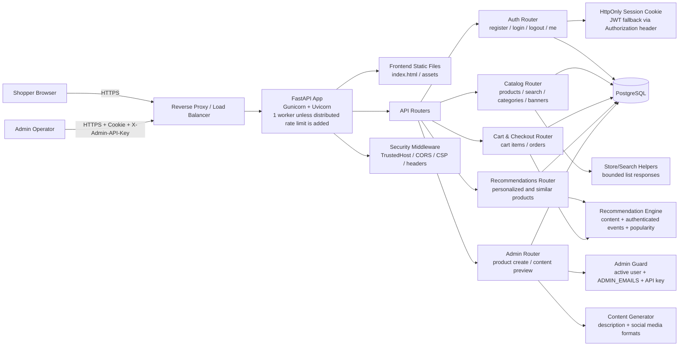
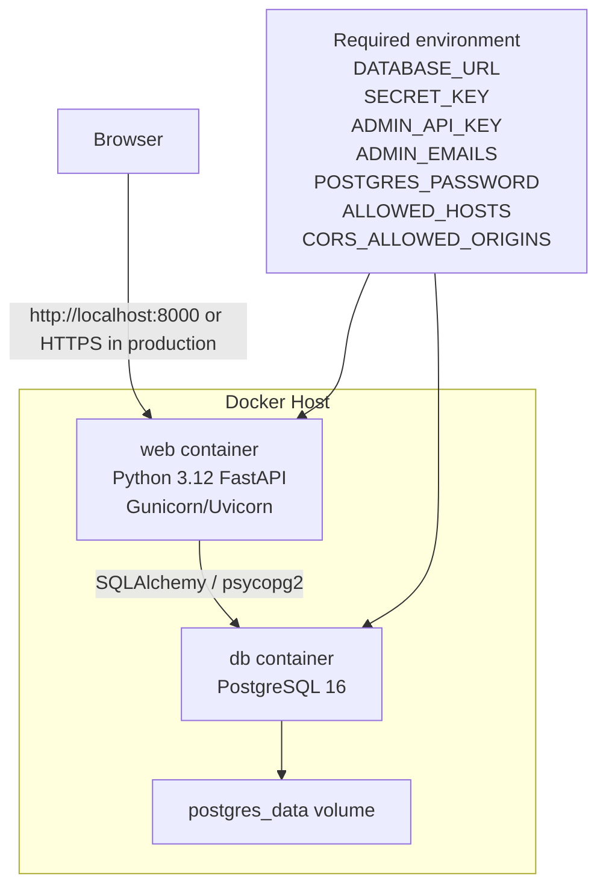
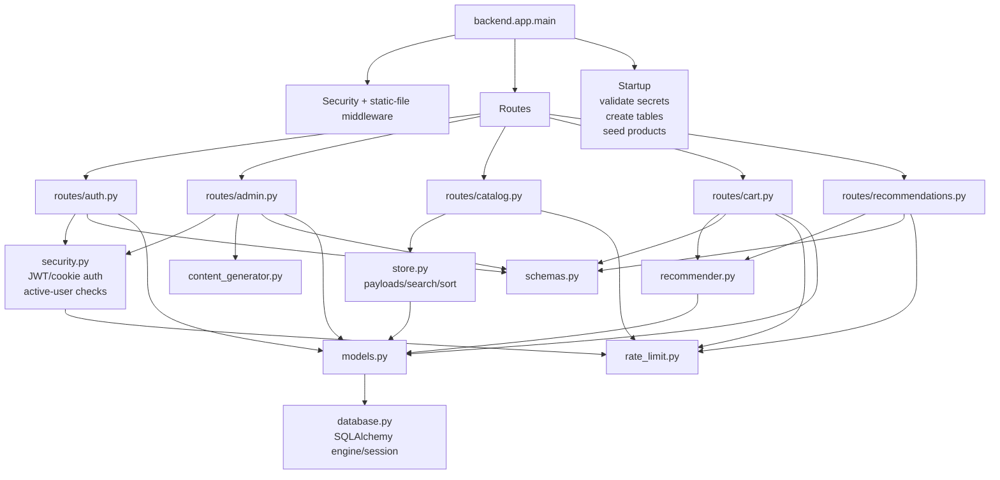
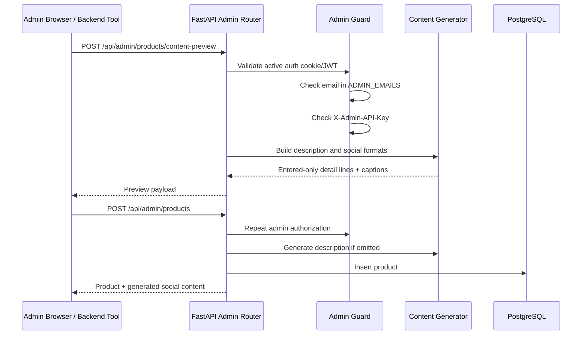
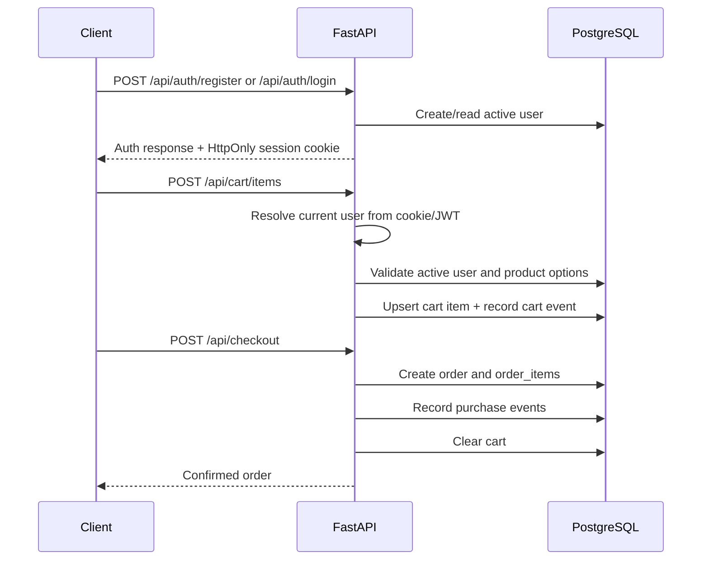
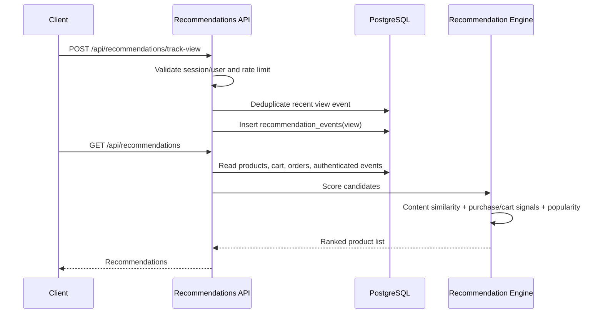
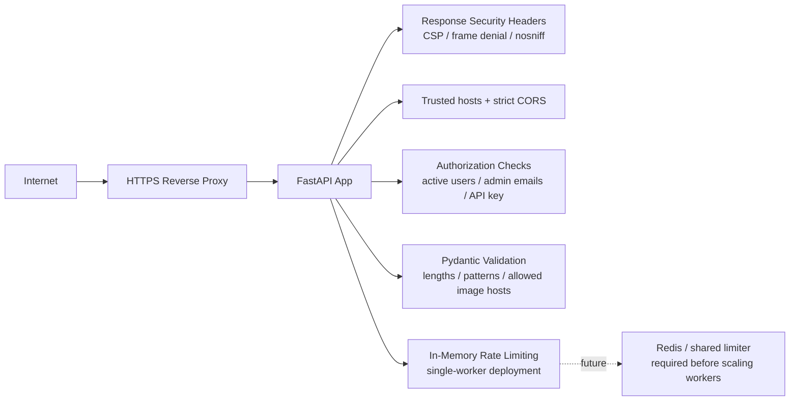

# Architecture Diagram

## High-Level Architecture

## Container Architecture

## Backend Module Diagram

## Admin Content Flow

## Authentication And Checkout Flow

## Recommendation Data Flow

## Security Boundaries

